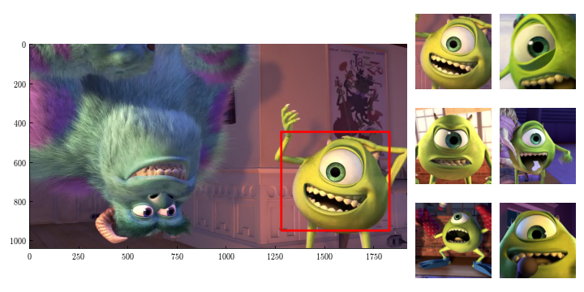

# mike-detection
This project focuses on the detection of Mike Wazowski from Monsters Inc. (2001) through the application of multi-scale template matching, specifically targeting his iris. Approximately 2100 frames in the film containing Mike were identified using this method. The process involves scaling down grayscale frames from the original film and applying template matching with various scaling factors for the iris template.

The single requirement is that you should dump your copy of the film to a JPEG sequence (~2.5G on 12fps). Processing all frames can be completed within 20 minutes. However, it's important to note that the detection may yield around ~15% false positives. Template matching proves highly effective when the template is present in the image; however, in the absence of the template, it tends to generate confidently false positives.

False positives occurs often for example whenever there is a large black circular object against a white background. Although the detection method could be improven or a better classification method could be implemented for accepting/rejecting matches, removing the false positives from the image set is a straightforward task. False positives are spotted easily in a file browser and can all be deleted wihtin a couple of minutes. Note, whenever we find false positives, they often occur consecutively since they are part of the same shot/scene which makes them easy to spot and to remove.